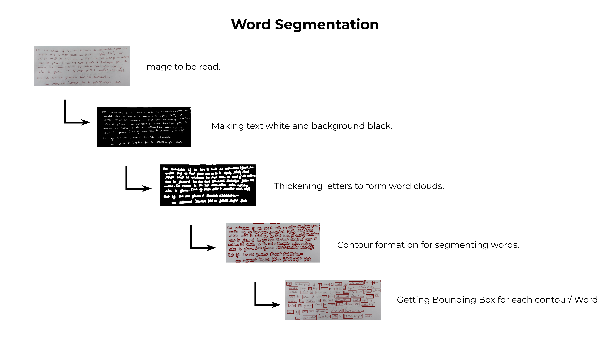
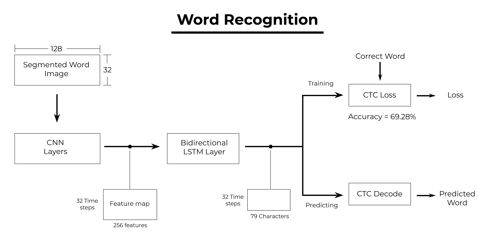

# OCR-MissionEd

## CURSIVE HANDWRITING RECOGNITION

**Part I – Word Segmentation**
This approach works on the fact that cursive handwritten words have very less or no gap between letters of the same word in comparison to gap between two words. So thickening of letters give word clouds with which bounding boxes of each word can be found. These are then sorted in order.

**Part II – Word Recognition**
  •	The segmented word is converted to a binary image with dimensions 128x32.
  
  •	The CNN layers extract features from the image and gives 256 features of dimension 1x32.

  •	The entire feature map Is divided into 32 time-stamps, so at each time stamp 256 features are passed in the LSTM layer.

  •	In each turn it predicts the character among the 79 characters (78 characters + 1 blank) and we get a matrix of dimension 32X79.

  •	Hence the maximum length of the word can be 32.

  •	It is then passed to the final layer – Connectionist Temporal Classification Layer (CTC) 

  •	While Training CTC is given the ground truth and it computes the loss on passing the matrix

  •	While Predicting CTC decodes the matrix by eliminating the blanks and gives the predicted word.
